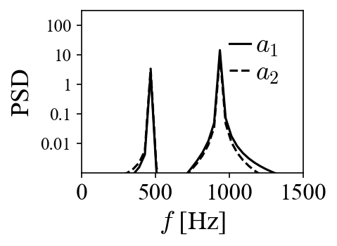

Pattern recognition with POD
============================

For this tutorial, we will look at how to decompose the following time series of
(synthesized) vector fields that contains a typical vortex pattern found in
swirl-stabilized combustors using POD:

.. image:: images/mov_pvc.gif
   :scale: 50 %

The goal is to try to recognize the flow pattern based on the POD results.

Synthesize dataset
^^^^^^^^^^^^^^^^^^

This vortex pattern is a signature of the 3-dimensional helical precessing
vortex core in a 2D cut plane. This is usually seen in planar Particle Image
Velocimetry measurements. To create these traveling vortices,  two stationary
modes are required as dictated by:

.. math::
  \boldsymbol{v}(x,t)=e^{-iwt}\boldsymbol{\Phi}(x)=\cos wt\cdot\Re(\boldsymbol{\Phi}) + \sin wt\cdot\Im(\boldsymbol{\Phi})

In this case :math:`\Re(\boldsymbol{\Phi})` and :math:`\Im(\boldsymbol{\Phi})`
are constructed as:

respectively, with temporal behaviors set as:

Notice that the two stationary modes have a spatial shift of roughly a quarter
of the wavelength and a temporal shift of 90 degrees (as implied in the
equation above).
Now that we have an artificial dataset, we can decompose it with the aim of
identifying this vortex pattern. What kind of POD modes do we expect to extract
out of it?

.. note:: The same dataset can be created using functions given in
  ``examples.vortex_shedding``.

POD of the dataset
^^^^^^^^^^^^^^^^^^

Using the built-in function ``pod_modes``, the process can be carried
out on the dataset ``v_array`` (containing 400 frames at 10 kHz sampling rate,
the vortex dynamics is set at 470 Hz)
as:

.. code:: python

  from mrpod import pod_modes

  # v_array is the pre-generated dataset
  pod_results = pod_modes(v_array, num_of_modes=4, normalize_mode=True)

  # get the modes and projection coefficients
  proj_coeffs = pod_results['proj_coeffs']
  modes = pod_results['modes']
  eigvals = pod_results['eigvals']
  # normalize eigenvalues
  eigvals = eigvals/eigvals.sum()*100

Normalizing the eigenvalues is a common practice to get a sense of the
contribution of the POD modes to the total kinetic energy. From the results we
can see that the first two POD modes have nearly identical eigenvalues and
compose nearly 100% of the kinetic energy. If we visualize the two POD modes in
the same fashion as the vector fields above, we get:

As can be seen, these two POD modes look nearly identical to the two modes used
to construct the dataset. The results suggest that two POD modes are needed to
describe a traveling vortex in the flow field. Bearing this in mind, let's look
at the projection coefficients of these two modes:

When the projection coefficients are plotted against each other in a so-called
phase portrait, they fall onto a perfect circle, indicating the phase shift of
90 degrees. A peak at 470 Hz can be identified in both of their power spectra
densities (PSD). Both the phase shift and the peak frequency match the values
used to generate the traveling vortices in the first place.

Without prior knowledge of how the flow dynamic is created, it is
perhaps not immediately clear what we should make of the POD modes. The example
shown here aims to answer this question: how can we identify coherent structures
in the flow field (or similar environments) from the POD results? The clues can
be found above and can be summarized below:

- Two POD modes are necessary to describe a traveling structure;

- They should have similar spatial appearance and comparable eigenvalues;

- Their projection coefficients should exhibit a regular correlation in the
  phase portrait,

- which should have very similar footprints in the spectral domain.

These 4 criteria should be considered when trying to recognize physical flow
patterns based on data-driven POD.

Reduced-order reconstruction
^^^^^^^^^^^^^^^^^^^^^^^^^^^^

Sometimes it is not immediately clear from the POD modes what flow pattern they
represent. It is therefore useful to visualize the flow pattern, especially in
the case of noisy dataset, such as the following:

This dataset is identical to the one shown on the top of this page but with
added random (white) noise in each frame to obscure the pattern of the traveling
vortices. From POD of the dataset (also 400 frames at 10 kHz), we get (first two
modes):

.. image:: images/fig_pvc_ps_noisy.png
  :scale: 66 %

The results are nearly identical to the ones from the original dataset. It is
clear that with this noise level POD has no problem of extracting the modes
associated to the flow pattern. Since now that the flow pattern is not
immediately clear from the noisy dataset, can we somehow visualize it with the
POD modes? Recall how the original dataset is generated and analogously we can
"reconstruct" the dataset with selected modes according to

.. math::
  \boldsymbol{v}_{\mathrm{reduced}}=\sum_{i=1}^{n}a_i\boldsymbol{\Phi}_i

where :math:`n\leqslant N` (N is the total number of modes with non-zero
eigenvalues). If we include just the two modes corresponding to the traveling
vortices, the equation becomes essentially equivalent to the one shown on the
top and the "reduced-order" flow field becomes:

.. image:: images/mov_pvc.gif
   :scale: 50 %

So now we have a visual idea what the POD modes entail. This also shows how POD
can be used to denoise a dataset, i.e., by leaving out noisy modes during the
reduced-order reconstruction.

Where POD fails
^^^^^^^^^^^^^^^

Sub-noise-level dynamics
""""""""""""""""""""""""

We have seen how POD can be used to denoise a dataset and extract obscured flow
pattern from it. There is however a limit. When the flow pattern is overwhelmed
by noise (in terms of kinetic energy), POD won't perform as well, as shown for
the noisier dataset below:

The noise level has been cranked way up. The POD results below are quite noisy
to the point that they cannot really be used to unambiguously visualize the
hidden flow pattern (only the first two modes are shown):

Coexistence of multiple dynamics
""""""""""""""""""""""""""""""""

Another drawback of POD is that it is a purely energy-based decomposition
process and it disregards all temporal correlations in the dataset. Even if we
were to randomly shuffle the 400 frames in the datasets above, we would get
exactly the same results (we wouldn't be able to get the frequency of the
traveling vortices though). This lack of so-called "dynamic ranking" becomes
quite problematic in a scenario where multiple dynamics coexist across a wide
range of time scales.

To demonstrate this, we can introduce another vortex pattern into the dataset
that has different spatial and temporal behaviors from the one above:

And our goal now is try to decompose the new mixed dataset below to separate
these two flow patterns:

If we perform POD on this dataset, we get the first two modes (mode 1 and 2):

and the following two modes (mode 3 and 4):

It is obvious that POD does not just automatically "group" or "isolate" the same
dynamic into two modes. Instead, it essentially lumps different dynamics and
distribute them among several modes (four modes in this case). Neither the
spatial modes nor their projection coefficients possess the spectral purity to
allow unambiguous interpretation of the underlying dynamics.

.. warning:: From these two examples it is clear that POD modes do not equate
  physical patterns. It is always necessary to first understand the underlying
  physics (in this case, the traveling structures) before attempting to
  interpret the POD results.

.. seealso:: To fix this issue, we need to introduce dynamic ranking into the
  POD process. In the next tutorial :doc:`vector_field_decomposition_2`, MRPOD
  is demonstrated on these two "challenging" datasets to showcase its
  capabilities.