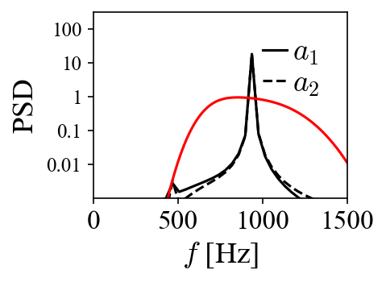
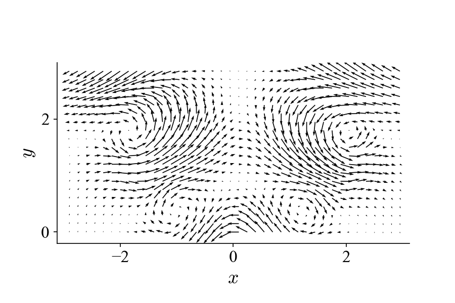

Pattern recognition with MRPOD
==============================

.. note:: Please refer to the previous tutorial
  :doc:`vector_field_decomposition_1` for more details regarding the
  synthesized datasets and the performances of POD in pattern recognition.
  Instead of ``pod_modes``, the function ``mrpod_detail_bundle`` will be used
  to carry out the task.

We will pick up right where we left in the previous tutorial and use the same
examples to demonstrate the advantages of MRPOD over POD for pattern recognition
in the flow field.

Sub-noise-level dynamics
^^^^^^^^^^^^^^^^^^^^^^^^

For the very noisy dataset created to challenge POD:

.. image:: images/mov_pvc_subnoise.gif
   :scale: 50 %

By performing MRPOD within a shortpass imposed by the composite wavelet filter,
we can obtain the following two modes (mode 1 and 2):

Comparing to the results achieved with POD in the previous tutorial, the
superior performance of MRPOD on this problem is quite striking. The bandpass
(shown as the red line in the phase portrait) can be narrowed to further improve
the denoising capability.

Coexistence of multiple dynamics
^^^^^^^^^^^^^^^^^^^^^^^^^^^^^^^^

For the dataset with two superpositioned dynamics:

.. image:: images/mov_mix.gif
   :scale: 50 %

We can design two bandpasses to isolate the two distinct dynamics in the
spectral domain and carry out MRPOD accordingly. For the first (original)
dynamic we can impose a lowpass filter and get:

Analogously we can impose a bandpass filter to extract the added dynamic:

Now we have separated these two dynamics and we can inspect them without the
spectral cross-talk that we saw in the previous tutorial with POD. Using the
reduced-order reconstruction introduced in the previous section, we can
visualize these two dynamics separately as:

.. image:: images/mov_tv.gif
   :scale: 50 %

.. warning:: The composite wavelet filters must be tailored to the specific
  problem at hand by considering the necessary spectral isolations, the length
  of the dataset and the desired outcome. MRPOD is not a one-size-fits-all
  technique.